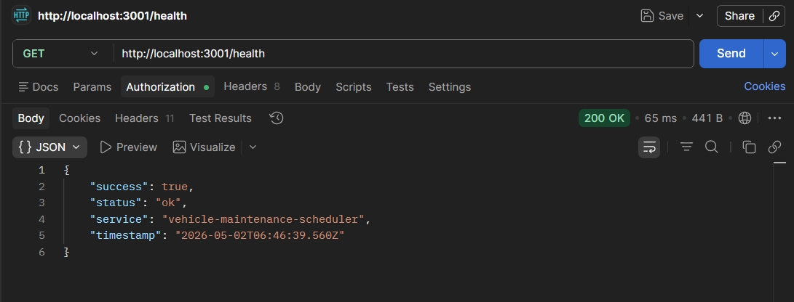
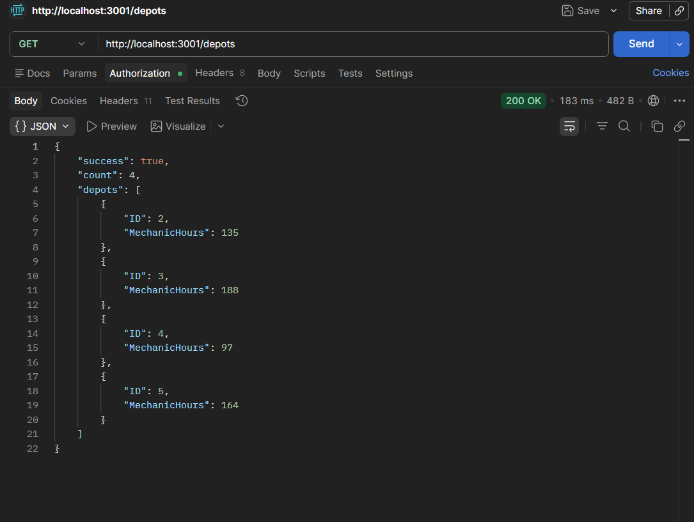
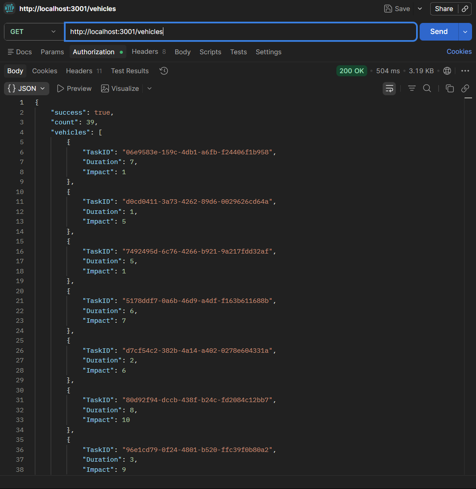
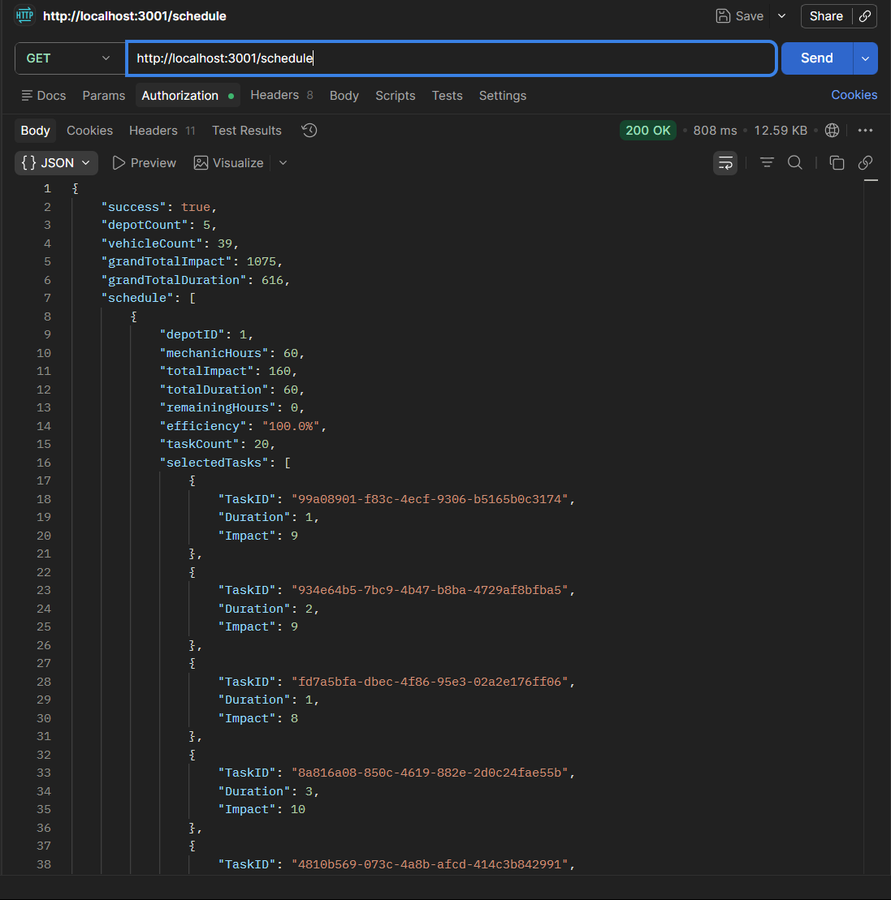

# 🚗 Vehicle Maintenance Scheduler


---

## 📌 Overview

A backend service that intelligently schedules vehicle maintenance tasks across depots using constraint-based optimization. The system accepts vehicle and depot data, applies an optimized scheduling algorithm, and returns a prioritized maintenance plan — all through a clean REST API.

---

## 🗂️ Project Structure

```
vehicle-maintenance-scheduler/
├── index.js              # Entry point
├── routes/
│   ├── health.js         # Health check route
│   ├── depots.js         # Depot listing route
│   ├── vehicles.js       # Vehicle listing route
│   └── schedule.js       # Scheduling logic routes
├── middleware/
│   └── logger.js         # Request logging middleware
├── utils/
│   └── knapsack.js       # 0/1 Knapsack optimization logic
├── screenshots/          # API response screenshots
├── package.json
└── README.md
```

---

## 🚀 How to Run

### 1. Install Dependencies

```bash
npm install
```

### 2. Start the Server

```bash
node index.js
```

> The server runs on **http://localhost:3000** by default.

---

## 📡 API Endpoints

| Method | Endpoint | Description |
|--------|----------|-------------|
| `GET` | `/health` | Returns server health status |
| `GET` | `/depots` | Lists all available depots |
| `GET` | `/vehicles` | Lists all vehicles and their details |
| `POST` | `/schedule` | Generates optimized maintenance schedule |
| `GET` | `/schedule/:depotId` | Fetches schedule for a specific depot |

---

## 🧠 Approach

The scheduling engine is built around the **0/1 Knapsack algorithm**:

- Each vehicle's maintenance task is modeled as an item with a **cost** (time/resource) and **value** (priority score).
- The depot's available capacity acts as the **knapsack weight limit**.
- The algorithm selects the optimal subset of tasks that maximizes total priority without exceeding depot capacity.
- This ensures the most critical vehicles are scheduled first within real-world resource constraints.

---

## 📋 Logging

All incoming HTTP requests are captured by a lightweight middleware layer that logs:

- Request method and route path
- Timestamp of each request
- Response status codes

Logs are printed to the console in a structured, readable format for easy debugging and monitoring.

---

## 🛠️ Tech Stack

| Technology | Purpose |
|------------|---------|
| **Node.js** | Runtime environment |
| **Express.js** | REST API framework |
| **Axios** | HTTP client for external requests |
| **0/1 Knapsack** | Optimization algorithm for scheduling |

---

## 📸 Screenshots

### Health Check


### Depots Response


### Vehicles Response


### Schedule Response


### Schedule by Depot ID


---

## 📝 Notes

- Ensure all required dependencies are installed before starting the server.
- The scheduling endpoint processes data in-memory; no database setup is required.
- API responses follow a consistent JSON structure across all endpoints.
- The `/schedule/:depotId` route returns a filtered view of the full schedule for the given depot.

---
