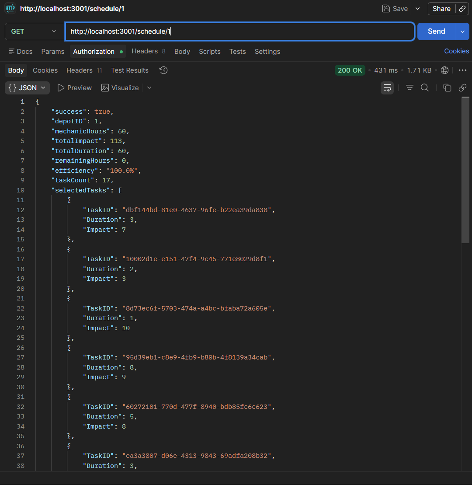

# 🚗 Vehicle Maintenance Scheduler


---

## 📌 Overview

A backend service that intelligently schedules vehicle maintenance tasks across depots using a **0/1 Knapsack optimization approach**. The system fetches vehicle and depot data from external APIs, applies an optimized scheduling algorithm, and returns a prioritized maintenance plan — all through a clean REST API.

---

## 🗂️ Project Structure

```
logging_middleware/
vehicle_maintenance_scheduler/
notification_app_be/
notification_system_design.md
screenshots/
.gitignore
```

---

## 🚀 How to Run

### 1. Install Dependencies

```bash
npm install
```

### 2. Start the Server

```bash
node index.js
```

> The server runs on **http://localhost:3001** by default.

---

## 📡 API Endpoints

### 🔧 Scheduler Service — Port `3001`

| Method | Endpoint | Description |
|--------|----------|-------------|
| `GET` | `/health` | Returns server health status |
| `GET` | `/depots` | Lists all available depots |
| `GET` | `/vehicles` | Lists all vehicles and their details |
| `GET` | `/schedule` | Generates optimized maintenance schedule |
| `GET` | `/schedule/:depotId` | Fetches schedule for a specific depot |

### 🔔 Notification Service — Port `3002`

| Method | Endpoint | Description |
|--------|----------|-------------|
| `GET` | `/notifications` | Retrieves all notifications |
| `POST` | `/notifications/broadcast` | Broadcasts a notification to specified students |
| `GET` | `/notifications/dlq` | Fetches failed messages from the dead letter queue |
| `POST` | `/notifications/dlq/retry` | Retries failed messages from the dead letter queue |

**Request Body** — `POST /notifications/broadcast`:
```json
{
  "student_ids": [1, 2, 3],
  "message": "test notification"
}
```

---

## 🧠 Approach

The scheduling engine is built around the **0/1 Knapsack algorithm**:

- Each vehicle's maintenance task is modeled as an item with a **cost** (time/resource) and **value** (priority score).
- The depot's available capacity acts as the **knapsack weight limit**.
- The algorithm selects the optimal subset of tasks that maximizes total priority without exceeding depot capacity.
- This ensures the most critical vehicles are scheduled first within real-world resource constraints.

---

## 📋 Logging

A centralized logging middleware is used across all APIs. Logs are integrated with an external logging service and capture request flow and system events.

---

## 🛠️ Tech Stack

| Technology | Purpose |
|------------|---------|
| **Node.js** | Runtime environment |
| **Express.js** | REST API framework |
| **Axios** | HTTP client for external requests |
| **0/1 Knapsack** | Optimization algorithm for scheduling |

---

## 📸 Screenshots

### Health Check


### Depots Response


### Vehicles Response


### Schedule Response


### Schedule by Depot ID


---

## 📝 Notes

- Ensure all required dependencies are installed before starting the server.
- The scheduling endpoint processes data in-memory; no database setup is required.
- API responses follow a consistent JSON structure across all endpoints.
- The `/schedule/:depotId` route returns a filtered view of the full schedule for the given depot.

---
